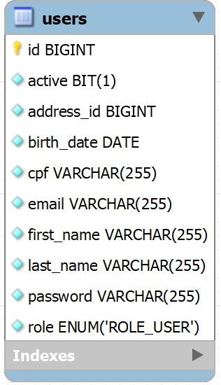

# Challenge 3 - Gerenciamento de Usuários: MSUser (CompassUOL)
O projeto consiste no desenvolvimento de uma API REST para um sistema de gerenciamento de usuários, utilizando as tecnologias e conhecimentos aprendidos até o momento durante essa jornada do programa de bolsas de estágio da Compass UOL | Back-end Journey (Spring Boot) - AWS Cloud Context.

O projeto foi organizado em formato de microsserviços, onde cada microsserviço é responsável por uma parte do sistema. Segue os microsserviços desenvolvidos e a funcionalidade de cada um:

| **Microsserviço** | **Funcionalidade**                                                                                                                                                                                                  |
|-------------------|---------------------------------------------------------------------------------------------------------------------------------------------------------------------------------------------------------------------|
| [MSUser](https://github.com/quasemago/Compass_Challenge3_MSUser)            | É responsável por armazenar e gerenciar os dados dos usuários, sendo integrado ao MSAddress e MSNotification.                                                                                                       |
| [MSAddress](https://github.com/quasemago/Compass_Challenge3_MSAddress)         | Encapsula a API ViaCEP e fornece um endpoint para consulta de endereço, tanto por CEP quanto por Id. Caso esse CEP não exista na base dados, consome a API ViaCEP e persiste o endereço para consultas posteriores. |
| [MSNotification](https://github.com/quasemago/Compass_Challenge3_MSNotification)    | Recebe notificações de eventos por parte dos usuários (MSUser), sendo eventos de CREATE, UPDATE, UPDATE_PASSWORD e LOGIN. Armazena essas notificações de eventos em um banco de dados NoSQL MongoDB.                |

### Autor do Projeto
O projeto foi desenvolvido por **Bruno Patrick Formehl Ronning**.

| **E-mail**                           | **Usuário Github** |
|--------------------------------------|--------------------|
| bruno.ronning.pb@compasso.com.br     | quasemago          |

## Sumário
- [Challenge 3 - Gerenciamento de Usuários: MSUser (CompassUOL)](#challenge-3---gerenciamento-de-usuários-msuser-compassuol)
    - [Autor do Projeto](#autor-do-projeto)
    - [Tecnologias Utilizadas](#tecnologias-utilizadas)
      - [Dependências](#dependências)
  - [Microsserviço de Usuários (MSUser)](#microsserviço-de-usuários-msuser)
      - [Estrutura do banco de dados](#estrutura-do-banco-de-dados)
      - [Regras de negócio](#regras-de-negócio)
    - [Endpoints](#endpoints)
    - [Payloads](#payloads)
    - [Fluxo de erros](#fluxo-de-erros)
  - [Como executar o projeto](#como-executar-o-projeto)
      - [Requisitos](#requisitos)
      - [Pré-configurações](#pré-configurações)
      - [Executando o projeto (Terminal)](#executando-o-projeto-terminal)
          - [Projeto em execução](#projeto-em-execução)
      - [Coleção do Postman e Arquivo Swagger](#coleção-do-postman-e-arquivo-swagger)
          - [Coleção Postman](#coleção-postman)
          - [Arquivo Swagger](#arquivo-swagger)
  - [Considerações Finais](#considerações-finais)

## Tecnologias Utilizadas
- Java JDK 17
- Spring Boot 3

### Dependências
- Spring Boot Test (inclui o JUnit 5 e Mockito)
- Spring Web
- Spring Data JPA
- Spring Validation
- Spring DevTools
- Spring Security
- Spring Doc OpenAPI (Swagger)
- Spring for RabbitMQ
- Spring Cloud OpenFeign
- Lombok
- JJwt (Java JSON Web Token)
- Banco de dados H2 (utilizado apenas nos testes unitários)
- Banco de dados MySQL

---
# Microsserviço de Usuários (MSUser)
O microsserviço de usuários (MSUser) é responsável por armazenar e gerenciar os dados dos usuários, sendo integrado ao MSAddress e MSNotification.

Ademais, o MSUser tem uma integração direta com o MSAddress, sendo: ao criar um usuário, o MSUser envia uma requisição para o MSAddress, então o MSAddress retorna um payload de resposta contendo o endereço do CEP informado e o id relacionado a esse endereço.

O MSUser persistirá esse id do endereço atrelando ao usuário criado, e sempre que for necessário consultar um usuário existente, o MSUser enviará uma requisição para o MSAddress, passando o id do endereço atrelado ao usuário.

Já com o MSNotification, o MSUser envia uma mensagem para a fila de mensagens do RabbitMQ, notificando um evento em que um usuário foi criado, atualizado, atualizado a senha ou fez login.

### Estrutura do banco de dados
O MSUser utiliza o banco de dados MySQL, e a estrutura do mesmo é composta por apenas uma tabela chamada `users` referente a entidade `User`:



### Regras de Negócio
- Os campos `firstName` e `lastName` precisam ter no mínimo 3 caracteres.
- O campo `email` precisa estar no formato de um email válido e não deve permitir emails duplicados.
- O campo `cpf` precisa seguir o seguinte padrão e não pode ser duplicado (xxx-xxx-xxx.xx).
- O campo `password` precisa ter no mínimo 6 caracteres e tem que ser salva criptografada no banco.
- O campo `birthdate` precisa ser salvo no banco como o tipo date e tem que estar no formato ISO-8601 (https://pt.wikipedia.org/wiki/ISO_8601), entretanto na hora de serializar o objeto e enviar no payload do response esse campo precisa estar no formato dd/mm/aaaa.
- O campo `active` deve aceitar somente valores booleanos.

## Endpoints
A API REST do MSUser possui os seguintes endpoints:

| **Método** | **URL**                | **Descrição**                                       |
|------------|------------------------|-----------------------------------------------------|
| `POST`     | /v1/login              | Faz login para autenticar na API.                   |
| `POST`     | /v1/users              | Cria um novo usuário. (Não precisa de autenticação) |
| `GET`      | /v1/users/:id          | Recupera informações de usuário existente.          |
| `PUT`      | /v1/users/:id          | Atualiza um usuário existente.                      |
| `PUT`      | /v1/users/:id/password | Atualiza a senha de um usuário existente.           |

## Payloads
A API REST do MSUser utiliza os seguintes payloads para requisições (Request):
- `UserLoginRequest`: Payload utilizado para fazer login e autenticar na API. Exemplo:
    ```json
    {
      "email": "joao@hotmail.com",
      "password": "123456"
    }
    ```
- `UserCreateRequest`: Payload utilizado para criar um novo usuário. Exemplo:
    ```json
    {
      "firstName": "João",
      "lastName": "Exemplo",
      "cpf": "000.000.000-00",
      "birthDate": "1997-12-12",
      "email": "joao@hotmail.com",
      "cep": "01001-000",
      "password": "123456",
      "active": true
    }
    ```
- ``UserUpdateRequest``: Payload utilizado para atualizar um usuário existente. Exemplo:
    ```json
    {
      "firstName": "Ronaldo",
      "lastName": "Exemplo",
      "cpf": "000.000.000-00",
      "birthDate": "1999-11-11",
      "email": "ronaldo@hotmail.com",
      "cep": "01001-000",
      "active": true
    }
    ```
- ``UserPasswordRequest``: Payload utilizado para atualizar a senha de um usuário existente. Exemplo:
    ```json
    {
      "password": "123456"
    }
    ```

Ademais, a API REST do MSUser utiliza os seguintes payloads para resposta (Response):
- `JwtToken`: Payload utilizado para responder a requisição de login. Exemplo:
    ```json
    {
      "email": "exemplo@hotmail.com",
      "created": "*DATA DE CRIAÇÃO DO TOKEN*",
      "expiration": "*DATA DE EXPIRAÇÃO DO TOKEN*",
      "accessToken": "*HASH DO JWT TOKEN*"
    }
    ```
- `UserResponse`: Payload utilizado para responder às requisições de criação, recuperação e atualização de usuário. Exemplo:
    ```json
    {
      "id": 1,
      "firstName": "João",
      "lastName": "Teste",
      "cpf": "000.000.000-00",
      "birthDate": "11/11/1997",
      "email": "joao@hotmail.com",
      "address": {
        "id": 1,
        "street": "Praça da Sé",
        "city": "São Paulo",
        "state": "SP",
        "cep": "01001-000"
      },
      "active": true
    }
    ```

## Fluxo de erros
Para tratamento de exceções, a API possui um fluxo de erros padrão, que consiste em um payload de resposta chamado `ErrorMessage`, que possui as informações do código do erro, o _status_, a mensagem e por fim, se disponível, os detalhes do erro.

Algumas situações tratadas pelo fluxo de erros são:

- Erro de regra de negócio:
```json
{
  "code": 409,
  "status": "Conflict",
  "message": "Já existe um usuário com o e-mail ou CPF informado.",
  "details": []
}
```
- Erro de validação:
```json
{
  "code": 400,
  "status": "Bad Request",
  "message": "Campo(s) inválido(s).",
  "details": [
    {
      "field": "email",
      "message": "O e-mail informado não é válido."
    },
    {
      "field": "password",
      "message": "A senha precisa ter pelo menos 6 caracteres."
    }
  ]
}
```
- Erro de autenticação:
```json
{
  "code": 401,
  "status": "Unauthorized",
  "message": "Credenciais de Login Inválidas.",
  "details": []
}
```

---
# Como executar o projeto
O projeto foi desenvolvido utilizando a linguagem de programação Java, utilizando o Java Development Kit (JDK) na versão 17.
Portanto, para executar o projeto, é necessário ter o JDK 17 instalado na máquina, que pode ser baixado através do link: [Download Java JDK 17](https://www.oracle.com/java/technologies/downloads/#java17)

### Requisitos
Para executar o projeto do microsserviço MSUser, é necessário que os demais microsserviços estejam em execução, sendo eles o **[MSAddress](https://github.com/quasemago/Compass_Challenge3_MSAddress)** e **[MSNotification](https://github.com/quasemago/Compass_Challenge3_MSNotification)**.

Caso tente executar o MSUser isoladamente, o mesmo irá falhar na execução, visto que o MSUser depende do **[MSAddress](https://github.com/quasemago/Compass_Challenge3_MSAddress)** e **[MSNotification](https://github.com/quasemago/Compass_Challenge3_MSNotification)** para funcionar corretamente.

### Pré-configurações
Antes de executar o projeto, é necessário fazer algumas configurações, como, por exemplo, a configuração do banco de dados MySQL.
Para isso, basta acessar o arquivo ``application.yml`` localizado na pasta ``src/main/resources`` e alterar as seguintes propriedades de acordo com suas preferências.

Porém, é recomendado utilizar variáveis de ambiente para configuração do projeto, evitando assim que informações sensíveis fiquem expostas no código-fonte, além de não ser necessário recompilar o projeto toda vez que for necessário alterar alguma configuração.
Caso você não configure as variáveis de ambiente, o projeto utilizará as configurações padrões.

**Segue a lista de propriedades que podem ser configuradas via variáveis de ambiente:**

| **Nome da varíavel**        | **Descrição**                             | **Valor Padrão**                                                                               |
|-----------------------------|-------------------------------------------|------------------------------------------------------------------------------------------------|
| TOMCAT_PORT                 | Porta para subir o servidor WEB Tomcat    | 8080                                                                                           |
| MYSQL_URL_HOST              | URL de conexão do banco MySQL             | jdbc:mysql://localhost:3306/compasschallenge3_msuser?useSSL=false&allowPublicKeyRetrieval=true |
| MYSQL_USERNAME              | Usuário para conexão MySQL                | root                                                                                           |
| MYSQL_PASSWORD              | Senha do usuário para conexão MySQL       | 123456                                                                                         |
| RABBITMQ_HOST               | IP/DNS do host RabbitMQ                   | localhost                                                                                      |
| RABBITMQ_PORT               | Porta de conexão do RabbitMQ              | 5672                                                                                           |
| RABBITMQ_USERNAME           | Usuário para conexão do RabbitMQ          | guest                                                                                          |
| RABBITMQ_PASSWORD           | Senha do usuário para conexão do RabbitMQ | guest                                                                                          |
| CHALLENGE3_MQ_USER_QUEUE    | Nome da fila de mensagens do RabbitMQ     | user-queue                                                                                     |
| CHALLENGE3_JWT_SECRET       | Chave secreta para geração do Token JWT   | 909266500255685261705041354583000                                                              |
| CHALLENGE3_JWT_EXPIRATION   | Duração do Token JWT (em milissegundos)   | 3600000                                                                                        |
| CHALLENGE3_MSADDRESS_APIURL | URL da API do microsserviço MSAddress     | http://localhost:8081/v1/address                                                               |

## Executando o projeto (Terminal)
Para executar o projeto diretamente via terminal, além do JDK 17, é necessário ter o _apache maven_ instalado na máquina, que pode ser baixado através do link: [Download Apache Maven](https://maven.apache.org/download.cgi)

Após tudo instalado, basta abrir o terminal na pasta raiz do projeto, e executar o comando ``mvn clean install`` para que todas as dependências sejam baixadas. Após isso execute o comando ``mvn clean package`` para compilar nosso projeto.

Após a execução dos comandos acima, observe que será criado uma pasta chamada ``target`` na raiz do projeto, essa pasta contem o nosso projeto compilado, sendo nomeado de ``msuser-1.0.jar``. Após entrar na pasta, basta executar o arquivo compilado do projeto utilizando o java.

Para executar o projeto, basta executar o comando ``java -jar msuser-1.0.jar``.

### Projeto em execução
Com o projeto já em execução, basta acessar o endereço ``/docs-msuser.html`` para acessar a documentação da API por meio do Swagger.
Por exemplo, se estiver executando o projeto localmente com as configurações padrões, o endereço será ``http://localhost:8080/docs-msuser.html``.

## Coleção do Postman e Arquivo Swagger

### Coleção Postman
Para facilitar o uso da API, foi criado uma coleção do Postman com todas as requisições da API, que pode ser baixada através do link: [Download Postman Collection](CompassUOL%20-%20Challenge%203%20Bruno%20Patrick.postman_collection.json)

Para uso da coleção do Postman, também foi incluído uma configuração de variáveis de ambiente para facilitar o uso da coleção, que pode ser baixada através do link: [Download Postman Environment](CompassUOL%20Challenge%203%20-%20Bruno%20Patrick.postman_environment.json)

Portanto, para utilizar a coleção do Postman, basta importar a coleção e a variável de ambiente no Postman, e então utilizar as requisições da API. Não esqueça de alterar os valores das variáveis de ambiente de acordo com suas configurações.

### Arquivo Swagger
Ademais, foi gerado um arquivo em JSON do Swagger da API, que pode ser baixado através do link [Download Swagger File](CompassUOL%20Challenge%203%20-%20MSUser%20Bruno%20Patrick_Swagger.json), você pode importar esse arquivo no [Swagger Editor](https://editor.swagger.io/) para visualizar a documentação da API.

---
# Considerações Finais
O terceiro desafio (Challenge 3) do programa de bolsas de estágio da Compass UOL | Back-end Journey (Spring Boot) - AWS Cloud Context, representou uma grande oportunidade de aprendizado para aplicar os conhecimentos adquiridos até o momento no programa.

Ao utilizar tecnologias como Spring Boot, Swagger e JUnit e Mockito, foi possível criar uma API robusta, testada e bem documentada, seguindo boas práticas de desenvolvimento, garantindo assim a qualidade do projeto, além de facilitar o uso da API por parte de outros desenvolvedores.

Portanto, é importante destacar que esse desafio foi de grande importância, pois além de implementar uma API REST, que havia sido o foco do desafio anterior, foi necessário implementar uma integração entre microsserviços, utilizando de serviços de mensageria como o RabbitMQ e serviços de requisição HTTP como o OpenFeign.

Agradeço à Compass UOL pela oportunidade de participar do programa de bolsas de estágio, e por proporcionar desafios que contribuem para o meu crescimento profissional.

Atenciosamente, [Bruno Patrick Formehl Ronning](#autor-do-projeto).